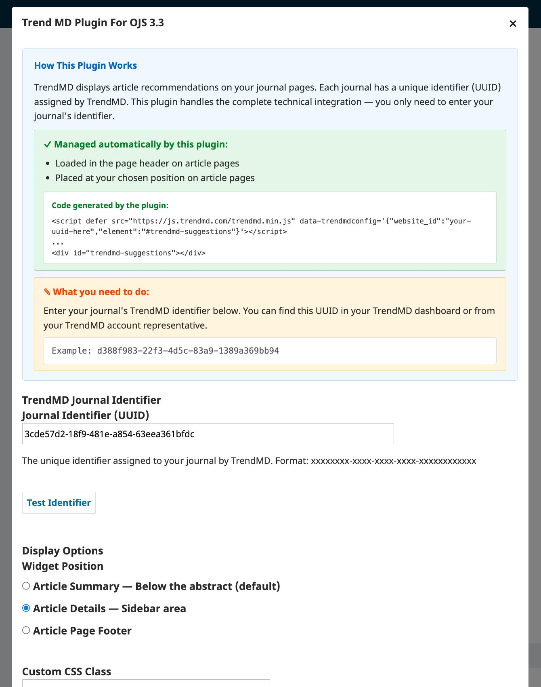
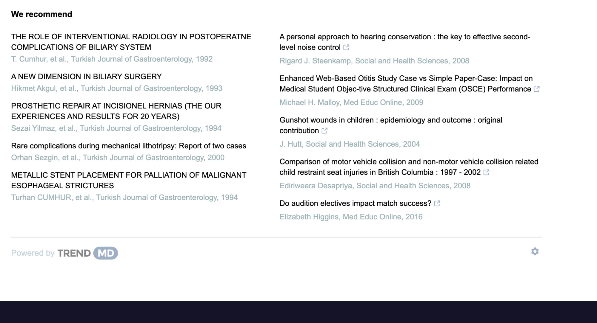

# TrendMD Widget Plugin for OJS

Integrates the [TrendMD](https://www.trendmd.com/) article recommendation widget into OJS 3.3+ journal article pages.

No template editing required — enter your journal's TrendMD identifier and the plugin handles the rest.

## Screenshots

### Plugin Settings

### TrendMD Widget on Article Page

## Features

- **Simple Setup** — Enter your journal's TrendMD UUID. No code pasting, no template modifications.
- **Automatic Integration** — Loads `trendmd.min.js` with the correct `data-trendmdconfig` in the page header and places the `#trendmd-suggestions` container at your chosen position.
- **Per-Journal Configuration** — Each journal context stores its own TrendMD identifier, fully supporting multi-journal OJS installations.
- **Configurable Position** — Place the widget below the abstract, in the sidebar, or in the page footer.
- **UUID Validation** — Built-in validation button checks the identifier format before saving.
- **Placeholder Mode** — When no identifier is configured, a visible notice appears at the widget position so administrators can verify placement before going live.
- **Custom CSS Class** — Add your own class to the widget wrapper for theme-specific styling.
- **Bilingual Interface** — English and Turkish.

## Requirements

- OJS 3.3.0 or later
- PHP 7.4 – 8.2
- A [TrendMD](https://www.trendmd.com/) account with a journal identifier

## Installation

1. Download the latest release from [GitHub Releases](https://github.com/ojs-services/trendMDojs/releases)
2. Go to **Settings → Website → Plugins → Upload A New Plugin**
3. Upload the `.tar.gz` file
4. Enable the plugin under **Generic Plugins**

For manual installation, extract the archive to `plugins/generic/trendMDojs/`.

## Configuration

1. Enable the plugin and click **Settings**
2. Enter your journal's **TrendMD Identifier** (UUID)
3. Click **Validate Identifier** to verify the format
4. Select a **Widget Position**
5. Click **OK** to save

The widget will appear on article pages once a valid identifier is saved.

## How It Works

| Component | Managed By |
|-----------|-----------|
| `<script defer src="trendmd.min.js" data-trendmdconfig="...">` | Plugin (automatic) |
| `

` | Plugin (at chosen position) |
| Journal UUID | Administrator (one-time setup) |

## Widget Positions

| Option | OJS Hook | Description |
|--------|----------|-------------|
| Article Summary | `Templates::Article::Main` | Below the abstract (default) |
| Article Details | `Templates::Article::Details` | Sidebar area |
| Page Footer | `Templates::Article::Footer::PageFooter` | Bottom of the article page |

## Multi-Journal Support

Each journal in an OJS installation stores its own TrendMD identifier independently. Configure each journal through its own plugin settings.

## Compatibility

Tested with OJS 3.3.x on PHP 7.4, 8.0, 8.1, and 8.2. Compatible with Default, Manuscript, Bootstrap3, Health Sciences, and custom themes.

## License

GNU General Public License v3. See [COPYING](COPYING) for details.

## Support

- [GitHub Issues](https://github.com/ojs-services/trendMDojs/issues)
- [OJS Services](https://ojsservices.com)

Developed by **OJS Services**
